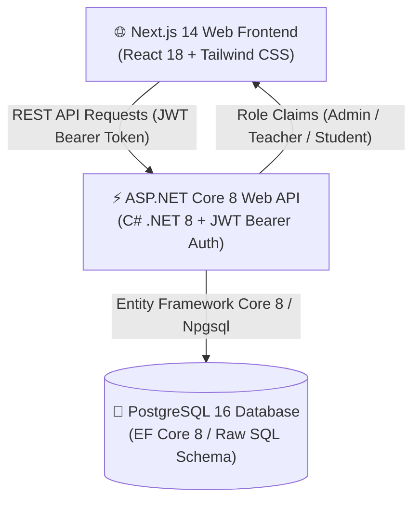

<div align="center">

# 🎓 Shikhon-EduProtal

### Enterprise Academic Coursework, Assignment & Evaluation Governance System

[](https://nextjs.org/)
[](https://reactjs.org/)
[](https://www.typescriptlang.org/)
[](https://dotnet.microsoft.com/)
[](https://www.postgresql.org/)
[](https://tailwindcss.com/)
[](https://www.docker.com/)
[](./LICENSE)

<p align="center">
  <a href="#-overview">Overview</a> •
  <a href="#-key-features--portals">Key Features</a> •
  <a href="#-system-architecture">Architecture</a> •
  <a href="#-project-structure">Project Structure</a> •
  <a href="#-demo-accounts">Demo Credentials</a> •
  <a href="#-quick-start--installation">Quick Start</a> •
  <a href="#-core-api-reference">API Reference</a> •
  <a href="#-license">License</a>
</p>

</div>

---

## 📖 Overview

**Shikhon-EduProtal** is a production-grade, full-stack educational management platform engineered for structured academic workflows. It delivers end-to-end coursework governance with dedicated role-based access control (RBAC) across three distinct user roles:

- 🛡️ **Administrator**: Manages academic hierarchies (classes, sections, subjects), teacher-subject assignments, and user provisioning.
- 👩‍🏫 **Teacher**: Creates and publishes assignments with rich instructions, deadline constraints, and evaluates student text submissions with marks and constructive feedback.
- 🎓 **Student**: Accesses published coursework filtered specifically for their enrolled class section, submits solutions, tracks evaluations, and resubmits if permitted.

---

## ✨ Key Features & Portals

### 🛡️ 1. Administrator Portal (`/admin`)
* **Real-time Analytics Dashboard**: Live metrics tracking total active teachers, enrolled students, academic classes, and subjects.
* **Class & Section Governance**: Create, edit, and maintain academic classes (e.g. *Class 10 - Section A*).
* **Subject & Faculty Mapping**: Register subjects tied to classes and assign authorized faculty members with exclusive assignment-creation privileges.
* **User Management**: Provision and manage Admin, Teacher, and Student accounts with soft-deactivation to preserve audit and grade records.

### 👩‍🏫 2. Teacher Portal (`/teacher`)
* **Coursework Command Center**: Comprehensive overview of draft vs. published coursework and live submission counters.
* **Assignment Builder**: Formulate coursework with rich descriptions, deadline pickers (date & time), maximum score caps, and toggleable resubmission permissions.
* **Subject Authorization Enforcement**: Backend-enforced validation ensuring teachers can only create assignments for subjects formally assigned to them.
* **Submission Grading Drawer**: Interactive review interface to inspect student text submissions, grade within score limits (`0 <= Marks <= MaxMarks`), and provide tailored feedback.

### 🎓 3. Student Portal (`/student`)
* **Enrolled Coursework Feed**: Dynamic timeline displaying upcoming assignments targeted strictly to the student's assigned class.
* **Submission Engine**: Formatted text-based solution input with instant deadline validation (`Submitted`, `Late`).
* **Resubmission Workflow**: Edit and resubmit responses prior to deadlines when enabled by the course instructor.
* **Score & Feedback Inspection**: Transparent grade report showing awarded score, percentage achievement, and teacher remarks.

---

## 🏗️ System Architecture



### 🛠️ Tech Stack Details

| Layer | Technologies | Highlights |
| :--- | :--- | :--- |
| **Frontend** | Next.js 14 (App Router), React 18, TypeScript, Tailwind CSS | Server & Client Components, Responsive Shell UI, Instant Notifications |
| **Backend** | ASP.NET Core 8 Web API, C#, Entity Framework Core 8 | Repository & Controller Pattern, Global Exception Middleware, Swagger OpenAPI |
| **Security** | JWT (JSON Web Tokens), BCrypt Password Hashing | Claim-based RBAC (`Admin`, `Teacher`, `Student`), CORS Isolation, Sanitized Queries |
| **Database** | PostgreSQL 16 | Relational Schema with Foreign Key Constraints & Cascade Safeguards |
| **DevOps & Containers** | Docker, Docker Compose | One-command multi-container orchestration (`postgres`, `backend`, `frontend`) |
| **Testing** | xUnit, EF Core InMemory | Automated unit test suite covering Auth, Role Boundaries, and Workflows |

---

## 📁 Project Structure

```text
Shikhon-EduProtal/
├── backend/
│   ├── src/
│   │   └── AssignmentSystem.Api/
│   │       ├── Common/             # Global error handling, current user context
│   │       ├── Controllers/        # Auth, Users, Classes, Assignments, Submissions
│   │       ├── Data/               # AppDbContext & DbSeeder
│   │       ├── Dtos/               # Request & Response Data Transfer Objects
│   │       ├── Entities/           # EF Core database models
│   │       ├── Middleware/         # ExceptionHandlingMiddleware
│   │       ├── Services/           # PasswordHasher & JwtTokenService
│   │       ├── appsettings.json    # Application configuration
│   │       └── Dockerfile          # Multi-stage .NET 8 build
│   └── tests/
│       └── AssignmentSystem.Tests/ # xUnit test suite (Auth, RBAC, Submissions)
│
├── database/
│   ├── schema.sql                  # PostgreSQL table definitions and constraints
│   └── seed.sql                    # Initial seed data for demo accounts
│
├── frontend/
│   ├── app/
│   │   ├── admin/                  # Admin portal pages (Users, Classes, Subjects)
│   │   ├── student/                # Student dashboard & assignment submission
│   │   ├── teacher/                # Teacher dashboard, creator & grading
│   │   ├── login/                  # High-end login screen with 1-click demo buttons
│   │   ├── layout.tsx              # Root layout with providers
│   │   └── globals.css             # Tailwind styling and design tokens
│   ├── components/                 # AppShell, Card, StatCard, Badge, Notifications
│   ├── lib/                        # API client, Auth context, TypeScript interfaces
│   └── Dockerfile                  # Production Next.js standalone container
│
├── docker-compose.yml              # Complete multi-service orchestration
├── package.json                    # Monorepo root configuration
├── LICENSE                         # MIT License
└── README.md                       # Documentation
```

---

## 🔑 Demo Accounts

For instant review and evaluation, the login page (`/login`) includes **1-click quick fill buttons** for these pre-seeded accounts:

| Role | Email | Password | Assigned Scope / Access |
| :--- | :--- | :--- | :--- |
| **🛡️ Admin** | `admin@school.edu` | `Admin@123` | Full administrative control & user provisioning |
| **👩‍🏫 Teacher** | `teacher@school.edu` | `Teacher@123` | Assigned to Physics (Class 10 - Section A) |
| **🎓 Student** | `student@school.edu` | `Student@123` | Enrolled in Class 10 - Section A |
| **🎓 Student (Alt)** | `farhana@school.edu` | `Student@123` | Enrolled in Class 10 - Section A |

---

## 🚀 Quick Start & Installation

### Option A: Docker Compose (Recommended)

Run the entire system (PostgreSQL + Backend API + Frontend) with one single command:

```bash
docker compose up --build
```

- 🌐 **Frontend**: `http://localhost:3000`
- ⚡ **Backend API**: `http://localhost:5215`
- 📚 **Swagger Docs**: `http://localhost:5215/swagger`

---

### Option B: Manual Local Setup

#### Prerequisites
* Node.js 18+ & npm
* .NET 8 SDK
* PostgreSQL 16 instance

#### 1. Database Setup
Execute the scripts located in the `database/` folder against your PostgreSQL server:
```bash
# Using psql or pgAdmin
psql -U postgres -d postgres -f database/schema.sql
psql -U postgres -d assignment_system -f database/seed.sql
```
*(Note: If connecting to an empty database, EF Core will automatically invoke `DbSeeder.SeedAsync()` on backend startup).*

#### 2. Backend API Setup
```bash
cd backend/src/AssignmentSystem.Api

# Restore dependencies and start server
dotnet restore
dotnet run
```
The API server will launch on `http://localhost:5215`.

To run automated backend unit tests:
```bash
cd backend/tests/AssignmentSystem.Tests
dotnet test
```

#### 3. Frontend Setup
```bash
cd frontend

# Install packages
npm install

# Start Next.js development server
npm run dev
```
Open `http://localhost:3000` in your web browser.

---

## 📡 Core API Reference

| Method | Endpoint | Access Role | Description |
| :--- | :--- | :--- | :--- |
| `POST` | `/api/auth/login` | Public | Authenticate user and receive JWT bearer token |
| `GET` | `/api/auth/me` | Authenticated | Retrieve authenticated user profile and claims |
| `GET` | `/api/classes` | Authenticated | List all classes and sections |
| `POST` | `/api/classes` | Admin | Create a new academic class |
| `GET` | `/api/subjects` | Authenticated | List subjects with assigned teachers |
| `POST` | `/api/subjects` | Admin | Create subject & assign authorized teacher |
| `GET` | `/api/assignments` | Teacher / Student | List filtered assignments for role |
| `POST` | `/api/assignments` | Teacher | Create and publish/draft coursework |
| `GET` | `/api/submissions/assignment/{id}` | Teacher | Retrieve all student submissions for an assignment |
| `POST` | `/api/submissions` | Student | Submit or resubmit coursework text solution |
| `POST` | `/api/submissions/{id}/grade` | Teacher | Award marks and provide feedback |
| `GET` | `/api/users` | Admin | Manage and list all system users |

---

## 🛡️ Security & Enterprise Highlights

- **🔒 Token-Based Authentication**: Secure JWT tokens containing user ID, email, role, and class section IDs.
- **🛡️ BCrypt Password Security**: Salting and hashing with work factor >= 11.
- **🗃️ Soft-Deactivation**: User deletion preserves foreign-key historical integrity for academic transcripts.
- **⚙️ CORS Protection**: Explicit whitelist preventing cross-origin forgery.
- **🛡️ Global Error Interceptor**: Sanitizes server exceptions before returning standardized JSON responses.

---

## 📄 License

This project is open-source software licensed under the [MIT License](./LICENSE).

---

<div align="center">
  <sub>Developed with modern standards by <b>Nusrat Hasan</b> • Built for scalable academic excellence.</sub>
</div>
