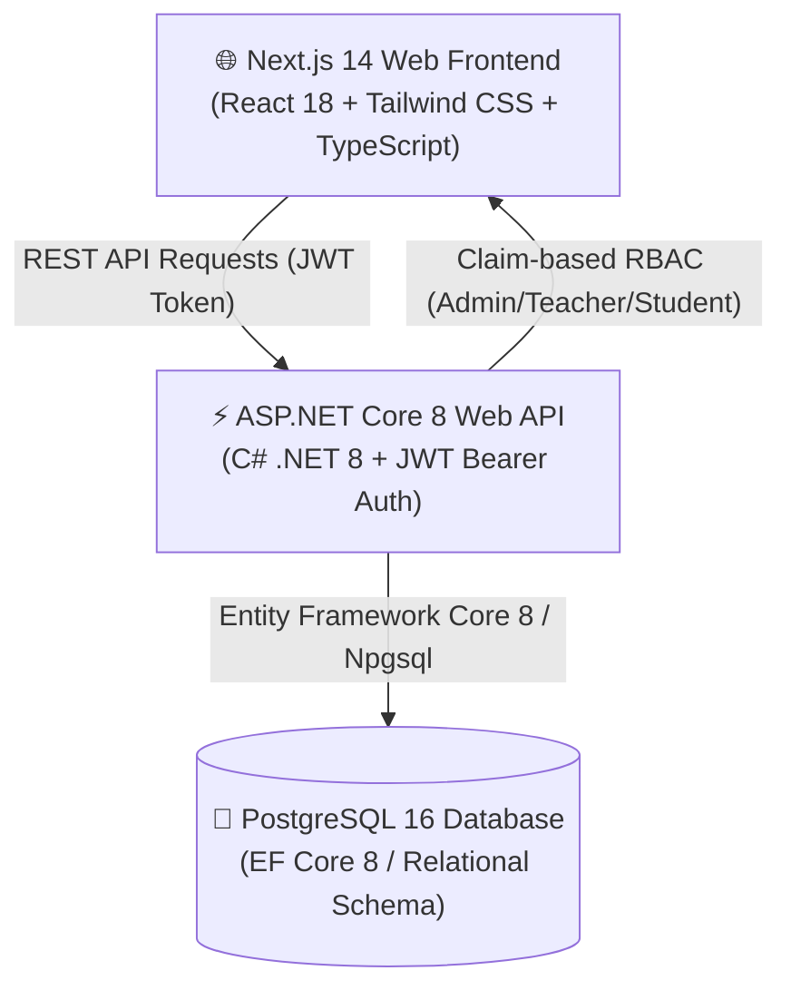

<div align="center">

# 🎓 OnnoRokom Projukti — EduPortal

### Enterprise Academic Coursework, Assignment & Automated Evaluation Ecosystem

[](https://nextjs.org/)
[](https://reactjs.org/)
[](https://www.typescriptlang.org/)
[](https://dotnet.microsoft.com/)
[](https://www.postgresql.org/)
[](https://tailwindcss.com/)
[](https://www.docker.com/)
[](./LICENSE)

<p align="center">
  <a href="#-overview">Overview</a> •
  <a href="#-key-features--role-portals">Role Portals</a> •
  <a href="#-modern-ui--design-system">Design System</a> •
  <a href="#-system-architecture">Architecture</a> •
  <a href="#-demo-credentials--1-click-login">Demo Accounts</a> •
  <a href="#-quick-start--installation">Quick Start</a> •
  <a href="#-core-api-reference">API Reference</a> •
  <a href="#-license">License</a>
</p>

</div>

---

## 📖 Overview

**OnnoRokom Projukti — EduPortal** is a high-performance, full-stack enterprise education management platform engineered for structured academic workflows, curriculum assignment distribution, submission tracking, and automated grading governance.

It delivers strict role-based access control (RBAC) across three distinct portals:
- 🛡️ **Administrator Portal (`/admin`)**: Institutional structure setup, class and section definitions, subject-to-teacher authorization mapping, and user account provisioning.
- 👩‍🏫 **Teacher / Faculty Portal (`/teacher`)**: Assignment formulation with rich instructions, deadline constraints, maximum points, resubmission policy toggle, and interactive submission grading with custom remarks.
- 🎓 **Student Portal (`/student`)**: Filtered view of class coursework, online answer submission editor, deadline countdowns, resubmission handling, and instant evaluation scorecards.

---

## 🎨 Modern UI & Design System

The application features a modern corporate SaaS aesthetic with fluid animations and responsive glassmorphism:
- **Palette**: Cosmic violet (`#7c3aed`, `#6d28d9`), crisp white surfaces (`#ffffff`), and soft lavender canvas (`#faf8ff`).
- **Glassmorphism & Micro-Animations**: Translucent cards with backdrop blur, pulsing uptime indicators, interactive hover elevations (`hover:-translate-y-0.5`), and animated SVG academic badges.
- **Intelligent Fallback Architecture**: Automatically connects to the live ASP.NET Core & PostgreSQL backend, with seamless client-side demo fallback when testing offline or in preview environments.

---

## ✨ Key Features & Role Portals

### 🛡️ 1. Administrator Portal (`/admin`)
* **KPI Metrics & Governance**: Live counters for registered faculty, enrolled students, academic cohorts, and curriculum units.
* **Class & Cohort Management (`/admin/classes`)**: Create and organize grade levels and sections (e.g. *Class 10 - Section A*).
* **Subject & Faculty Mapping (`/admin/subjects`)**: Create curriculum subjects and delegate teaching authority to specific educators.
* **User Account Directory (`/admin/users`)**: Search, filter by role (Admin, Teacher, Student), and manage credentials with soft-deactivation.

### 👩‍🏫 2. Faculty / Teacher Portal (`/teacher`)
* **Coursework Command Center**: Summary of active vs. draft assignments and real-time student submission counts.
* **Assignment Builder (`/teacher/assignments/new`)**: Configure assignment titles, questions, deadlines, maximum marks, and toggle student resubmission permissions.
* **Submission Grading & Feedback (`/teacher/assignments/[id]`)**: Review student answers, award scores (`0 <= Marks <= MaxMarks`), and provide detailed constructive feedback.

### 🎓 3. Student Portal (`/student`)
* **Enrolled Coursework Timeline**: Auto-filtered assignment feed targeted strictly to the student's enrolled class.
* **Online Solution Submission (`/student/assignments/[id]`)**: Submit formatted answers before deadline expiration.
* **Resubmission Support**: Edit and update solutions prior to deadline when permitted by the course instructor.
* **Score & Remarks Inspection**: Clear scorecard displaying awarded marks and faculty remarks.

---

## 🏗️ System Architecture



### 🛠️ Technology Stack

| Layer | Technologies | Key Highlights |
| :--- | :--- | :--- |
| **Frontend** | Next.js 14 (App Router), React 18, TypeScript, Tailwind CSS | High-contrast purple SaaS theme, Glassmorphic AppShell, Offline Fallback |
| **Backend** | ASP.NET Core 8 Web API, C#, Entity Framework Core 8 | Repository & Controller Architecture, Global Error Middleware, Swagger OpenAPI |
| **Security** | JWT Bearer Tokens, BCrypt Hashing, RBAC | Role-protected controllers, CORS isolation, sanitized inputs |
| **Database** | PostgreSQL 16 | Relational Schema with Foreign Key Constraints & Cascade Safeguards |
| **DevOps & Containers** | Docker, Docker Compose | Multi-container orchestration (`postgres`, `backend`, `frontend`) |
| **Testing** | xUnit, EF Core InMemory | Unit test suite covering authentication, RBAC boundaries, and submissions |

---

## 📁 Project Structure

```text
OnnoRokom-Projukti--EduPortal/
├── backend/
│   ├── src/
│   │   └── AssignmentSystem.Api/
│   │       ├── Common/             # Global error handling & user context
│   │       ├── Controllers/        # Auth, Users, Classes, Assignments, Submissions
│   │       ├── Data/               # AppDbContext & DbSeeder
│   │       ├── Dtos/               # Request & Response Data Transfer Objects
│   │       ├── Entities/           # EF Core database models
│   │       ├── Middleware/         # ExceptionHandlingMiddleware
│   │       ├── Services/           # PasswordHasher & JwtTokenService
│   │       ├── appsettings.json    # Application configuration
│   │       └── Dockerfile          # Multi-stage .NET 8 build
│   └── tests/
│       └── AssignmentSystem.Tests/ # xUnit test suite
│
├── database/
│   ├── schema.sql                  # PostgreSQL table definitions
│   └── seed.sql                    # Initial seed data
│
├── frontend/
│   ├── app/
│   │   ├── admin/                  # Admin portal (Users, Classes, Subjects)
│   │   ├── student/                # Student portal & submission
│   │   ├── teacher/                # Teacher dashboard & grading
│   │   ├── login/                  # Educational purple illustration login
│   │   ├── layout.tsx              # Root layout with AuthProvider & AppShell
│   │   └── globals.css             # Tailwind styling & animations
│   ├── components/                 # AppShell, Card, StatCard, Badge, Pagination
│   ├── lib/                        # API client, Auth helpers, Types
│   └── Dockerfile                  # Production Next.js standalone container
│
├── docker-compose.yml              # Multi-container service configuration
├── package.json                    # Workspace root configuration
├── LICENSE                         # MIT License
└── README.md                       # Complete Documentation
```

---

## 🔑 Demo Credentials & 1-Click Login

The Login Page (`/login`) includes **1-Click Demo Buttons** to automatically populate credentials:

| Role | Email Address | Password | Access Scope |
| :--- | :--- | :--- | :--- |
| **🛡️ Administrator** | `admin@school.edu` | `password123` | Full system setup, user provisioning, class and subject management |
| **👩‍🏫 Faculty / Teacher** | `teacher@school.edu` | `password123` | Coursework creation, publication, and student submission grading |
| **🎓 Student** | `student@school.edu` | `password123` | Class assignment submission, score viewing, and resubmissions |

---

## 🚀 Quick Start & Installation

### Option A: Docker Compose (Recommended)

Run PostgreSQL, Backend API, and Frontend with a single command:

```bash
docker compose up --build
```

- 🌐 **Frontend Application**: `http://localhost:3000`
- ⚡ **Backend REST API**: `http://localhost:5215`
- 📚 **Interactive Swagger API Docs**: `http://localhost:5215/swagger`

---

### Option B: Manual Local Setup

#### Prerequisites
* Node.js 18+ & npm
* .NET 8 SDK
* PostgreSQL 16 instance (optional if using frontend demo mode)

#### 1. Database Setup (Optional if running full stack)
```bash
psql -U postgres -d postgres -f database/schema.sql
psql -U postgres -d assignment_system -f database/seed.sql
```

#### 2. Backend API Setup
```bash
cd backend/src/AssignmentSystem.Api
dotnet restore
dotnet run
```
The API server will launch on `http://localhost:5215`.

To execute automated backend test suite:
```bash
cd backend/tests/AssignmentSystem.Tests
dotnet test
```

#### 3. Frontend Setup
```bash
cd frontend
npm install
npm run dev
```
Open `http://localhost:3000` in your web browser.

---

## 📡 Core API Reference

| Method | Endpoint | Access Role | Description |
| :--- | :--- | :--- | :--- |
| `POST` | `/api/auth/login` | Public | Authenticate credentials and receive JWT bearer token |
| `GET` | `/api/auth/me` | Authenticated | Retrieve profile claims for the logged-in user |
| `GET` | `/api/classes` | Authenticated | Retrieve all academic classes and cohort sections |
| `POST` | `/api/classes` | Admin | Create a new academic class and section |
| `GET` | `/api/subjects` | Authenticated | List subjects with assigned faculty instructors |
| `POST` | `/api/subjects` | Admin | Register subject & assign authorized faculty |
| `GET` | `/api/assignments` | Teacher / Student | List role-filtered coursework assignments |
| `POST` | `/api/assignments` | Teacher | Create and publish/draft an assignment |
| `GET` | `/api/assignments/{id}/submissions` | Teacher | Retrieve all student submissions for an assignment |
| `POST` | `/api/assignments/{id}/submissions` | Student | Submit or update coursework solution |
| `POST` | `/api/submissions/{id}/grade` | Teacher | Award marks and provide written feedback |
| `GET` | `/api/users` | Admin | List and search all registered user accounts |

---

## 🛡️ Security & Enterprise Highlights

- **🔒 JWT Bearer Authentication**: Secure stateless tokens containing user IDs, roles, and classroom claims.
- **🛡️ BCrypt Cryptographic Hashing**: Work factor >= 11 for all stored credentials.
- **🗃️ Soft-Deactivation Safeguards**: User deactivation maintains relational audit trails and grade integrity.
- **⚙️ CORS Protection**: Configured origin whitelist to prevent unauthorized cross-origin calls.
- **🛡️ Global Error Handling**: Centralized exception middleware sanitizing production errors.

---

## 📄 License

This project is open-source software licensed under the [MIT License](./LICENSE).

---

<div align="center">
  <sub>Developed for <b>OnnoRokom Projukti Limited</b> • High-Performance Academic Management.</sub>
</div>

